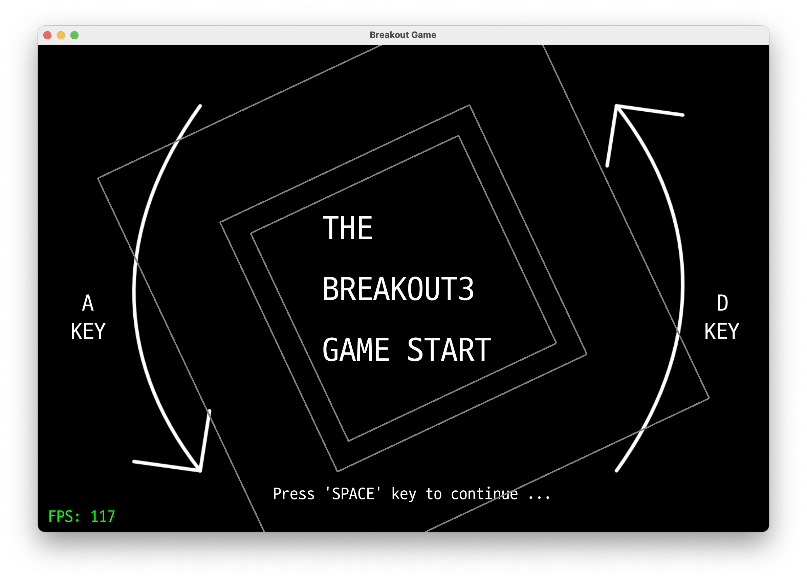
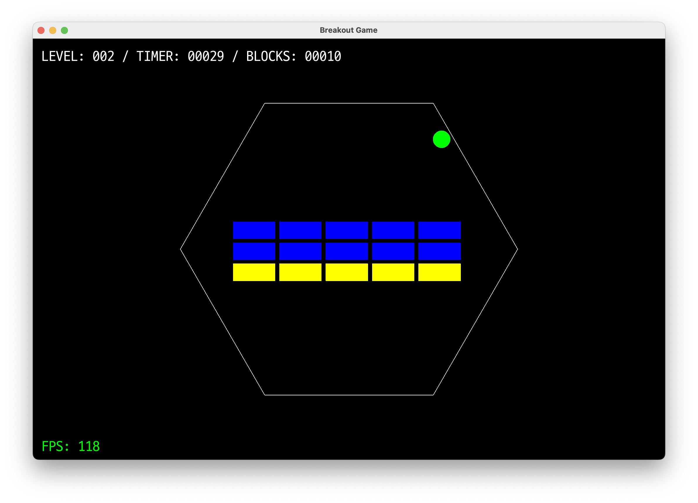
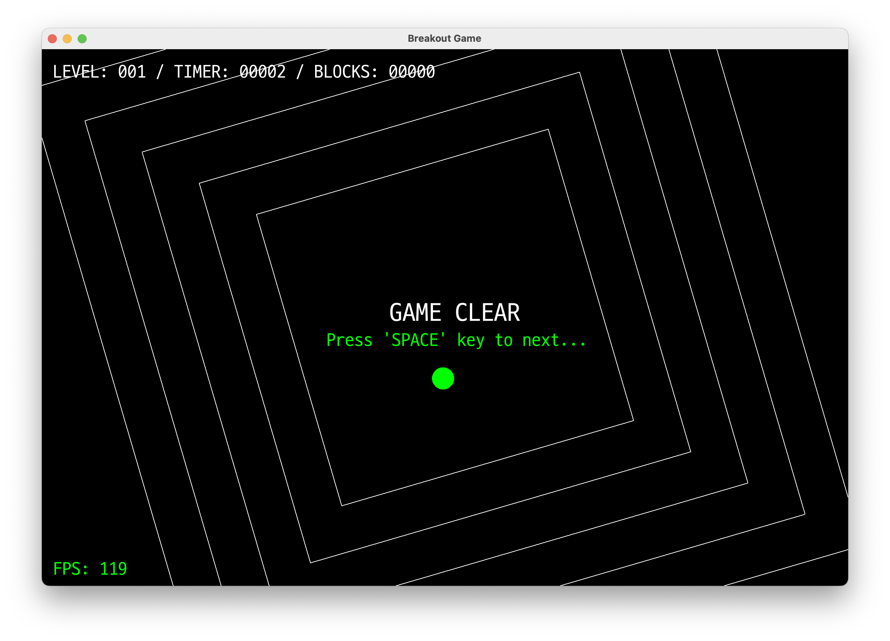

# BREAKOUT GAME
- [Korean(한국어)](README_kr.md)
- Brick Breaker Game Development Project





## Configuring the project development environment
- Project Management with CMAKE and Package Management with vcpkg
- Ability to build and compile development environments on a variety of platforms

## How to compile and run
### 1. Install g++, cmake, and git
```bash
# Windows

# 1. Install MSYS2 (a program that automatically configures the development environment on Windows)
# Installer: https://www.msys2.org/

# 2. Install G++ depending on your computer environment
$ pacman -S --needed base-devel mingw-w64-x86_64-toolchain

# 3. Installing Git
# Installer: https://git-scm.com/downloads
```

```bash
# Linux (Debian / Ubuntu)
$ sudo apt update

$ sudo apt install build-essential git cmake -y
```

```bash
# macOS (Homebrew)
$ brew install git cmake pkg-config
```

### 2. Build the project
```bash
# Get a project
$ git clone --recurse-submodules "https://github.com/yejun614/breakout3.git"

# Navigate to the project folder
$ cd breakout3

# Prepare the vcpkg
$ git clone "https://github.com/microsoft/vcpkg.git"

# Prepare vcpkg(2): For Windows
$ .\vcpkg\bootstrap-vcpkg.bat

# Prepare vcpkg(2): For Linux, macOS
$ ./vcpkg/bootstrap-vcpkg.sh

# Create a folder to store your build results
$ mkdir build

# Create a build file
$ cmake -DCMAKE_TOOLCHAIN_FILE=./vcpkg/scripts/buildsystems/vcpkg.cmake -B build

# build
$ cmake --build build

# Run the game
$ ./build/game
```

## Dependency packages
| Packages | Description | Websites | License | Documents |
|-------|-----------------------|-----------|----------|--------------|
| OpenGL | Computer Graphics Libraries | [PROJECT](https://www.opengl.org/) | [LICENSE](https://registry.khronos.org/OpenGL/index_gl.php) | |
| GLM | Math-related data structure support libraries | [PROJECT](https://www.opengl.org/sdk/libs/GLM/) | MIT License | |
| GLFW | Libraries that output OpenGL screens | [PROJECT](https://www.glfw.org/) | [LICENSE](https://www.glfw.org/license.html) | |
| FreeType | A library that fetches fonts and displays them on the screen. | [PROJECT](https://freetype.org/) | [LICENSE](https://freetype.org/license.html) | |
| FTGL | Libraries used with FreeType | [PROJECT](https://github.com/frankheckenbach/ftgl/tree/master) | [LICENSE](https://github.com/frankheckenbach/ftgl/blob/master/COPYING) | [DOCS](https://ftgl.sourceforge.net/docs/html/index.html) |
| json | JSON Data Structure Library | [PROJECT](https://github.com/nlohmann/json) | [LICENSE](https://github.com/nlohmann/json/blob/develop/LICENSE.MIT) | |
| miniaudio | Cross-platform audio library | [PROJECT](https://miniaud.io/) | [LICENSE](https://github.com/mackron/miniaudio/blob/master/LICENSE) | [DOCS](https://miniaud.io/docs/manual/index.html) | |
| stb_image | OpenGL video file processing and output support libraries | [PROJECT](https://github.com/nothings/stb) | [LICENSE](https://github.com/nothings/stb/blob/master/LICENSE) | |

## Copyright
- Photos and music (src/audio, src/img)
  - [Pixabay](https://pixabay.com/ko/service/license-summary/)
- Fonts (src/font)
  - [D2Coding](https://github.com/naver/d2codingfont/wiki/Open-Font-License)

## BREAKOUT3 Game and Game Engine Licenses
```
MIT License

Copyright (c) 2023 YeJun, Jung

Permission is hereby granted, free of charge, to any person obtaining a copy
of this software and associated documentation files (the "Software"), to deal
in the Software without restriction, including without limitation the rights
to use, copy, modify, merge, publish, distribute, sublicense, and/or sell
copies of the Software, and to permit persons to whom the Software is
furnished to do so, subject to the following conditions:

The above copyright notice and this permission notice shall be included in all
copies or substantial portions of the Software.

THE SOFTWARE IS PROVIDED "AS IS", WITHOUT WARRANTY OF ANY KIND, EXPRESS OR
IMPLIED, INCLUDING BUT NOT LIMITED TO THE WARRANTIES OF MERCHANTABILITY,
FITNESS FOR A PARTICULAR PURPOSE AND NONINFRINGEMENT. IN NO EVENT SHALL THE
AUTHORS OR COPYRIGHT HOLDERS BE LIABLE FOR ANY CLAIM, DAMAGES OR OTHER
LIABILITY, WHETHER IN AN ACTION OF CONTRACT, TORT OR OTHERWISE, ARISING FROM,
OUT OF OR IN CONNECTION WITH THE SOFTWARE OR THE USE OR OTHER DEALINGS IN THE
SOFTWARE.
```
