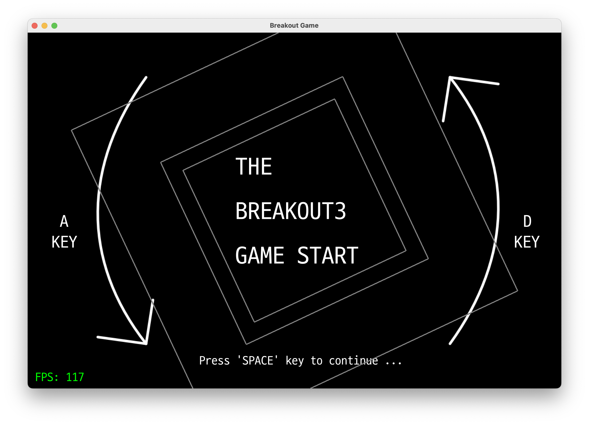

# BREAKOUT GAME
- 벽돌깨기 게임 개발 프로젝트




## 프로젝트 개발 환경 구성
- CMAKE를 사용한 프로젝트 관리와 vcpkg를 사용한 패키지 관리
- 다양한 플랫폼에서 개발 환경을 구축하고 컴파일 할 수 있음

## 컴파일 및 실행방법
### 1. g++, cmake 그리고 git 설치
```bash
# Windows

# 1. MSYS2 설치 (Windows에서 개발환경 자동 구성해주는 프로그램)
# 설치 프로그램: https://www.msys2.org/

# 2. 컴퓨터 환경에 따라서 g++ 설치
$ pacman -S --needed base-devel mingw-w64-x86_64-toolchain

# 3. Git 설치
# 설치 프로그램: https://git-scm.com/downloads
```

```bash
# Linux (Debian / Ubuntu)
$ sudo apt update

$ sudo apt install build-essential git cmake -y
```

```bash
# macOS (Homebrew)
$ brew install git cmake pkg-config
```

2. 프로젝트 빌드
```bash
# 프로젝트 가져오기
$ git clone --recurse-submodules "https://github.com/yejun614/breakout3.git"

# 프로젝트 폴더로 이동
$ cd breakout3

# vcpkg 준비
$ git clone "https://github.com/microsoft/vcpkg.git"

# vcpkg 준비(2): Windows의 경우
$ .\vcpkg\bootstrap-vcpkg.bat

# vcpkg 준비(2): Linux, macOS의 경우
$ ./vcpkg/bootstrap-vcpkg.sh

# 빌드 결과가 저장될 폴더 생성
$ mkdir build

# 빌드파일 생성
$ cmake -DCMAKE_TOOLCHAIN_FILE=./vcpkg/scripts/buildsystems/vcpkg.cmake -B build

# 빌드
$ cmake --build build

# 게임 실행
$ ./build/game
```

## 외부 의존성 패키지
| Packages | Description | Websites | License | Documents |
|-------|-----------------------|-----------|----------|--------------|
| OpenGL | 컴퓨터 그래픽스 라이브러리 | [PROJECT](https://www.opengl.org/) | [LICENSE](https://registry.khronos.org/OpenGL/index_gl.php) | |
| GLM | 수학 관련 데이터구조 지원 라이브러리 | [PROJECT](https://www.opengl.org/sdk/libs/GLM/) | MIT License | |
| GLFW | OpenGL 화면을 출력해 주는 라이브러리 | [PROJECT](https://www.glfw.org/) | [LICENSE](https://www.glfw.org/license.html) | |
| FreeType | 폰트를 불러와 화면에 표시해 주는 라이브러리 | [PROJECT](https://freetype.org/) | [LICENSE](https://freetype.org/license.html) | |
| FTGL | FreeType와 함께 사용되는 라이브러리 | [PROJECT](https://github.com/frankheckenbach/ftgl/tree/master) | [LICENSE](https://github.com/frankheckenbach/ftgl/blob/master/COPYING) | [DOCS](https://ftgl.sourceforge.net/docs/html/index.html) |
| json | JSON 데이터구조 라이브러리 | [PROJECT](https://github.com/nlohmann/json) | [LICENSE](https://github.com/nlohmann/json/blob/develop/LICENSE.MIT) | |
| miniaudio | 크로스 플랫폼 오디오 라이브러리 | [PROJECT](https://miniaud.io/) | [LICENSE](https://github.com/mackron/miniaudio/blob/master/LICENSE) | [DOCS](https://miniaud.io/docs/manual/index.html) | |
| stb_image | OpenGL 영상 파일 처리 및 출력 지원 라이브러리 | [PROJECT](https://github.com/nothings/stb) | [LICENSE](https://github.com/nothings/stb/blob/master/LICENSE) | |

## 저작권
- 사진 및 음원 (src/audio, src/img)
  - [Pixabay](https://pixabay.com/ko/service/license-summary/)
- 폰트 (src/font)
  - [D2Coding](https://github.com/naver/d2codingfont/wiki/Open-Font-License)

## BREAKOUT3 게임 및 게임엔진 라이선스
```
MIT License

Copyright (c) 2023 YeJun, Jung

Permission is hereby granted, free of charge, to any person obtaining a copy
of this software and associated documentation files (the "Software"), to deal
in the Software without restriction, including without limitation the rights
to use, copy, modify, merge, publish, distribute, sublicense, and/or sell
copies of the Software, and to permit persons to whom the Software is
furnished to do so, subject to the following conditions:

The above copyright notice and this permission notice shall be included in all
copies or substantial portions of the Software.

THE SOFTWARE IS PROVIDED "AS IS", WITHOUT WARRANTY OF ANY KIND, EXPRESS OR
IMPLIED, INCLUDING BUT NOT LIMITED TO THE WARRANTIES OF MERCHANTABILITY,
FITNESS FOR A PARTICULAR PURPOSE AND NONINFRINGEMENT. IN NO EVENT SHALL THE
AUTHORS OR COPYRIGHT HOLDERS BE LIABLE FOR ANY CLAIM, DAMAGES OR OTHER
LIABILITY, WHETHER IN AN ACTION OF CONTRACT, TORT OR OTHERWISE, ARISING FROM,
OUT OF OR IN CONNECTION WITH THE SOFTWARE OR THE USE OR OTHER DEALINGS IN THE
SOFTWARE.
```
